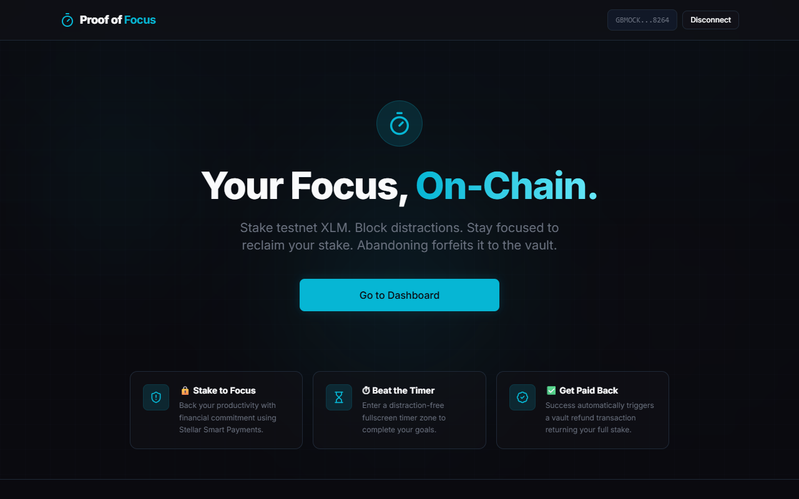

# Proof of Focus ⏱
> Stake XLM. Stay Focused. Earn It Back.

Proof of Focus turns productivity into a blockchain-verified commitment. Users stake testnet XLM using the Freighter browser wallet to begin a focus session. Completing the focus session automatically triggers a refund from a secure vault wallet on the Stellar ledger. Abandoning the session early forfeits the stake permanently to the vault, adding real financial "skin-in-the-game" to combat distraction.

---

## Features
- **Smart Staking Commitments**: Lock real behavioral stakes on the Stellar Testnet.
- **Distraction-Free Screen**: Screen transitions to fullscreen containing an SVG circular timer.
- **Freighter Wallet Guard**: Connect and interact securely using Freighter wallet. Automatically validates network environment configuration.
- **Auto-Refund Protocol**: Successful focus completion triggers a server-side refund using the Vault secret key without requiring user click confirmations.
- **Immutable Commitment Logs**: Local history logs save transaction hashes linked directly to the Stellar Expert block explorer.
- **Clean Forfeit Screen**: Simple forfeit screens to restart session configuration.

---

## Tech Stack
- **Frontend**: React 18 + Vite (ESM)
- **Styling**: Tailwind CSS v3 (Custom premium dark theme)
- **State Management**: Zustand
- **Router**: React Router v6
- **Animations**: Framer Motion & canvas-confetti
- **Stellar Network**:
  - SDK: `@stellar/stellar-sdk`
  - Browser Wallet: `@stellar/freighter-api`
  - Node Provider: SDF Horizon (`https://horizon-testnet.stellar.org`)

---

## Stellar Integration Architecture
1. **Stake Transaction (User → Vault)**:
   - Built client-side using `@stellar/stellar-sdk`.
   - Signed using the Freighter wallet browser extension.
   - Payments are sent to the configured `VITE_VAULT_PUBLIC_KEY` with a custom text memo: `FOCUS:${sessionId}:${duration}min`.
2. **Refund Transaction (Vault → User)**:
   - Executed automatically when the countdown hits zero.
   - Built and signed using `VITE_VAULT_SECRET_KEY` on-the-fly.
   - Custom text memo: `RETURN:${sessionId}`.
3. **Forfeit Flow**:
   - Abandoning or ending sessions early halts the transaction sequence.
   - Staked funds remain locked in the Vault wallet.

---

## Environment Variables
Create a `.env` file in the root directory:
```env
VITE_VAULT_PUBLIC_KEY=GCVFAWHKJGFILGSFJCE7Q55GJIHNIWNFHD2MBBJGTHDLWB5VS34M7PZE
VITE_VAULT_SECRET_KEY=SDDMYQGCIWRWR7K5ZZZ4WKQ64TN67GGEAHGKEU2CZP77JAECMWLPAZU2
VITE_HORIZON_URL=https://horizon-testnet.stellar.org
VITE_NETWORK_PASSPHRASE=Test SDF Network ; September 2015
```

---

## Local Setup
1. **Prerequisites**: Node.js installed on your machine.
2. **Install dependencies**:
   ```bash
   npm install
   ```
3. **Run local server**:
   ```bash
   npm run dev
   ```
4. **Build production bundle**:
   ```bash
   npm run build
   ```

---

## Wallet Configuration
Ensure you have the **Freighter Wallet Extension** installed:
1. Open Freighter settings.
2. Under "Network" settings, ensure your network selection is set to **Testnet**.
3. Fund your Freighter address using the Stellar Laboratory Friendbot tool: [Stellar Laboratory Friendbot](https://laboratory.stellar.org/#account-creator?network=testnet).

---

## Testnet Disclaimer
> [!WARNING]
> This application runs exclusively on the Stellar SDF Testnet network. The vault's private key is stored in client-side environment variables (`.env`) for demonstration purposes. In a production release, the vault secret signing logic must be encapsulated in a secure backend microservice/API to prevent compromise.

---

## Screenshots

Below are placeholders for the required submission screenshots. Save your screenshots into a `screenshots/` folder in this repository with the following filenames:

#### Wallet Connected State


#### Balance Displayed


#### Successful Testnet Transaction


#### Transaction Result Shown to User


---

## License
MIT License
